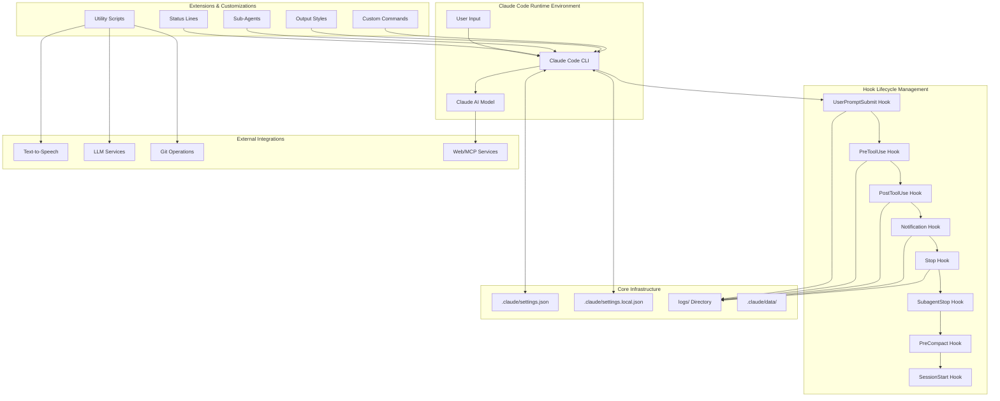
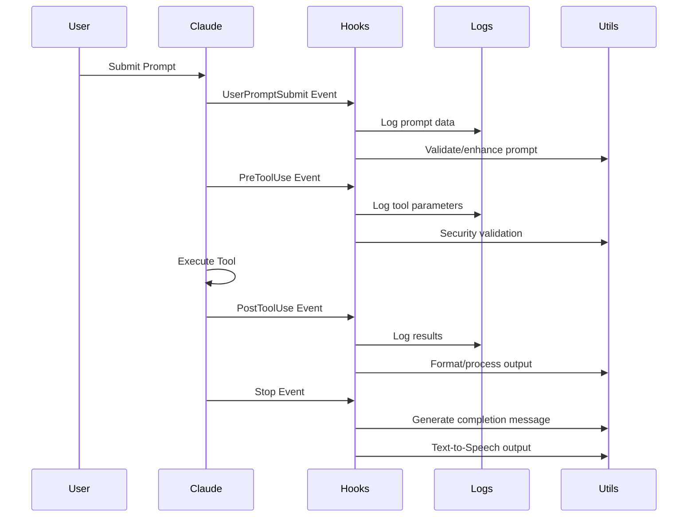
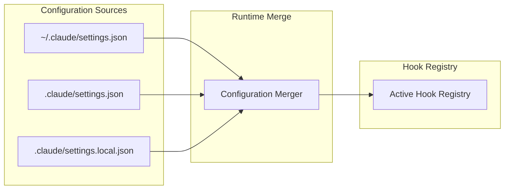
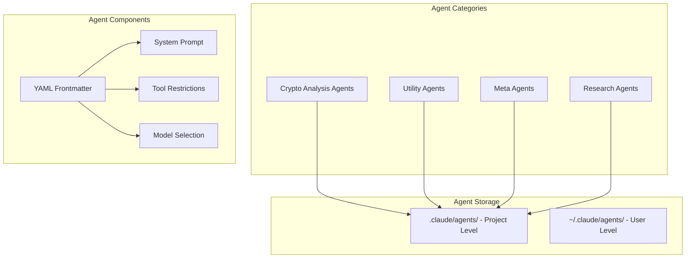
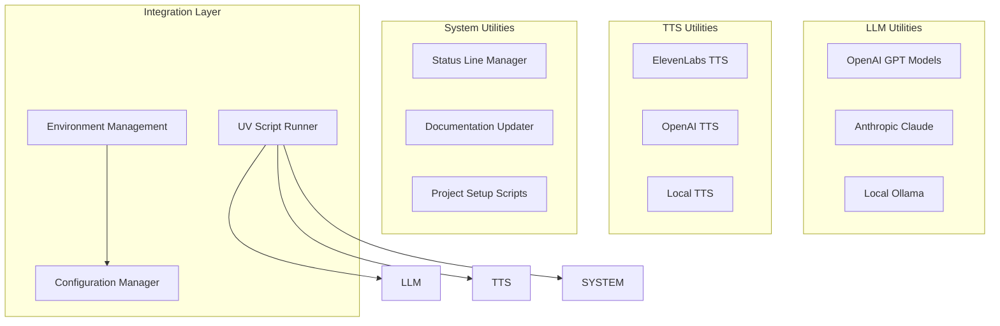
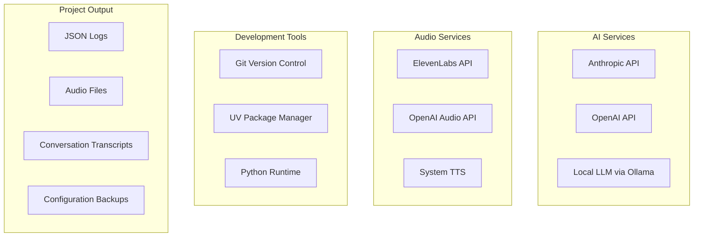
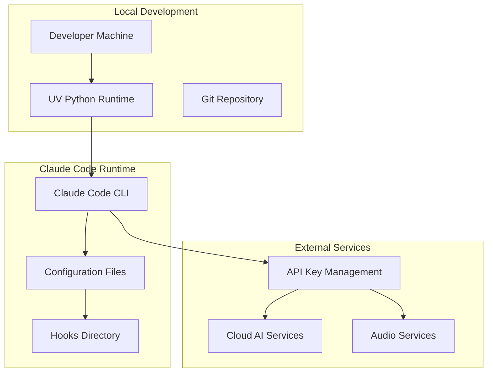

# Claude Code Hooks Mastery - Project Architecture

## 🏗️ High-Level System Architecture



---

## 📁 Directory Structure & Component Relationships

### **Root Level Components**

```
claude-code-hooks-mastery/
├── 📋 CLAUDE.md                    # Project-specific Claude instructions
├── 📚 README.md                    # Project documentation & features
├── 🏗️ ARCHITECTURE.md              # This file - system architecture
├── 🖼️ images/                       # Visual documentation assets
├── 📄 logs/                         # Hook execution logs (JSON)
├── 📖 ai_docs/                      # AI development documentation
├── 🎯 apps/                         # Sample applications
└── 🔧 utility scripts               # Project management tools
```

### **Claude Configuration (.claude/)**

```
.claude/
├── ⚙️ settings.json                 # Core hook configurations
├── 🔧 settings.local.json          # Local overrides (not committed)
├── 🪝 hooks/                        # Python hook implementations
├── 📊 status_lines/                 # Terminal status customizations
├── 🤖 agents/                       # Specialized sub-agent definitions
├── 🎨 output-styles/                # Response formatting styles
├── ⌨️ commands/                      # Custom slash commands
└── 💾 data/                         # Session & runtime data
```

---

## 🔄 Data Flow Architecture

### **1. Hook Execution Pipeline**



### **2. Configuration Management**



---

## 🧩 Component Architecture

### **🪝 Hook System Architecture**

| **Hook Type** | **Purpose** | **Blocking Capability** | **Key Files** |
|---------------|-------------|------------------------|---------------|
| **UserPromptSubmit** | Prompt validation & enhancement | ✅ Can block prompts | `user_prompt_submit.py` |
| **PreToolUse** | Security & parameter validation | ✅ Can block tools | `pre_tool_use.py` |
| **PostToolUse** | Result processing & formatting | ❌ Tool already executed | `post_tool_use.py` |
| **Notification** | Custom alerts & TTS | ❌ Informational only | `notification.py` |
| **Stop** | Completion processing & TTS | ✅ Can force continuation | `stop.py` |
| **SubagentStop** | Sub-agent completion handling | ✅ Can block sub-agent stop | `subagent_stop.py` |
| **PreCompact** | Pre-compaction backup | ❌ Cannot block compaction | `pre_compact.py` |
| **SessionStart** | Session initialization | ❌ Cannot block startup | `session_start.py` |

### **📊 Status Line System**

```mermaid
graph TB
    subgraph "Status Line Variants"
        SL1[status_line.py - Basic MVP]
        SL2[status_line_v2.py - Smart Prompts]
        SL3[status_line_v3.py - Agent Sessions]
        SL4[status_line_v4.py - Extended Metadata]
        SL85[status_line_v85.py - Advanced Monitoring]
        STEVE[steve_status_line.py - Detailed Metrics]
    end
    
    subgraph "Data Sources"
        GIT[Git Status]
        SESSION[Session Data]
        TRANSCRIPTS[Transcript Analysis]
        USAGE[Usage Metrics]
    end
    
    subgraph "Display Components"
        MODEL[Model Info]
        DIR[Directory]
        BRANCH[Git Branch]
        TOKENS[Token Usage]
        TOOLS[Active Tools]
        API[API Metrics]
    end
    
    GIT --> BRANCH
    SESSION --> MODEL
    SESSION --> DIR
    TRANSCRIPTS --> TOKENS
    TRANSCRIPTS --> TOOLS
    TRANSCRIPTS --> API
    
    SL1 --> MODEL
    SL1 --> DIR
    SL1 --> BRANCH
    
    STEVE --> MODEL
    STEVE --> DIR
    STEVE --> BRANCH
    STEVE --> TOKENS
    STEVE --> TOOLS
    STEVE --> API
```



### **🤖 Sub-Agent Architecture**



### **🛠️ Utility System Architecture**



---

## 📡 External Integration Points

### **🔌 MCP (Model Context Protocol) Integration**

| **MCP Server** | **Purpose** | **Hook Integration** |
|----------------|-------------|---------------------|
| **ElevenLabs** | Text-to-Speech, Voice Cloning | Used in Stop/Notification hooks |
| **Firecrawl** | Web Scraping & Research | Available for agent workflows |
| **Context7** | Documentation Retrieval | Used for development context |
| **Reddit** | Community Research | Used in research agents |
| **Playwright** | Browser Automation | Web testing and interaction |

### **🌐 Service Dependencies**



---

## 🚀 Execution Flow Patterns

### **Pattern 1: Hook-Driven Development Workflow**

```
User Input → UserPromptSubmit Hook → Security Validation → 
PreToolUse Hook → Tool Execution → PostToolUse Hook → 
Result Processing → Stop Hook → TTS Completion → Logs
```

### **Pattern 2: Sub-Agent Delegation**

```
Primary Agent → Task Analysis → Sub-Agent Selection → 
Sub-Agent Execution → SubagentStop Hook → Result Synthesis → 
Primary Agent Response → Stop Hook
```

### **Pattern 3: Status Line Updates**

```
Session Event → Data Collection → Metrics Calculation → 
Status Line Generation → Terminal Display Update
```

---

## 🔧 Deployment Architecture

### **Development Environment**



### **Production Deployment Considerations**

| **Component** | **Scaling Strategy** | **Security Considerations** |
|---------------|---------------------|----------------------------|
| **Hook Scripts** | UV isolated execution | Sandbox restrictions, timeout limits |
| **Logging System** | Rotation, compression | PII filtering, retention policies |
| **API Integrations** | Rate limiting, failover | Key rotation, environment isolation |
| **TTS Services** | Caching, local fallback | Audio data handling, privacy |

---

## 🔍 Key Architectural Decisions

### **✅ Design Principles**

1. **Deterministic Control**: Hooks provide guaranteed execution vs. LLM suggestions
2. **UV Single-File Architecture**: Self-contained scripts with embedded dependencies
3. **Layered Configuration**: User → Project → Local settings hierarchy
4. **Comprehensive Logging**: JSON-structured logs for all hook events
5. **Modular Extensions**: Status lines, agents, and output styles as plugins

### **🎯 Performance Optimizations**

- **Parallel Hook Execution**: Multiple hooks run concurrently where possible
- **Cached Dependencies**: UV manages efficient dependency resolution
- **Intelligent Fallbacks**: Multiple TTS/LLM providers with priority ordering
- **Session Persistence**: Reuse of session data across interactions

### **🔒 Security Architecture**

- **Command Validation**: PreToolUse hooks block dangerous operations
- **Environment Isolation**: UV scripts run in controlled environments
- **API Key Management**: Environment-based credential handling
- **Audit Trail**: Complete logging of all system interactions

---

## 📈 Extensibility Points

### **🔌 Plugin Architecture**

| **Extension Type** | **Location** | **Interface** |
|-------------------|--------------|---------------|
| **Hooks** | `.claude/hooks/` | Python scripts with JSON I/O |
| **Status Lines** | `.claude/status_lines/` | Python scripts returning status text |
| **Sub-Agents** | `.claude/agents/` | Markdown files with YAML frontmatter |
| **Output Styles** | `.claude/output-styles/` | Markdown prompt templates |
| **Commands** | `.claude/commands/` | Markdown command definitions |

### **🌟 Future Enhancement Opportunities**

- **WebUI Dashboard**: Visual hook management and log analysis
- **Advanced Analytics**: Usage patterns and performance metrics
- **Team Collaboration**: Shared hook libraries and configurations
- **CI/CD Integration**: Automated testing and deployment of hooks
- **Plugin Marketplace**: Community-contributed extensions

---

*This architecture enables a comprehensive, extensible system for mastering Claude Code hooks with enterprise-grade logging, monitoring, and customization capabilities.*